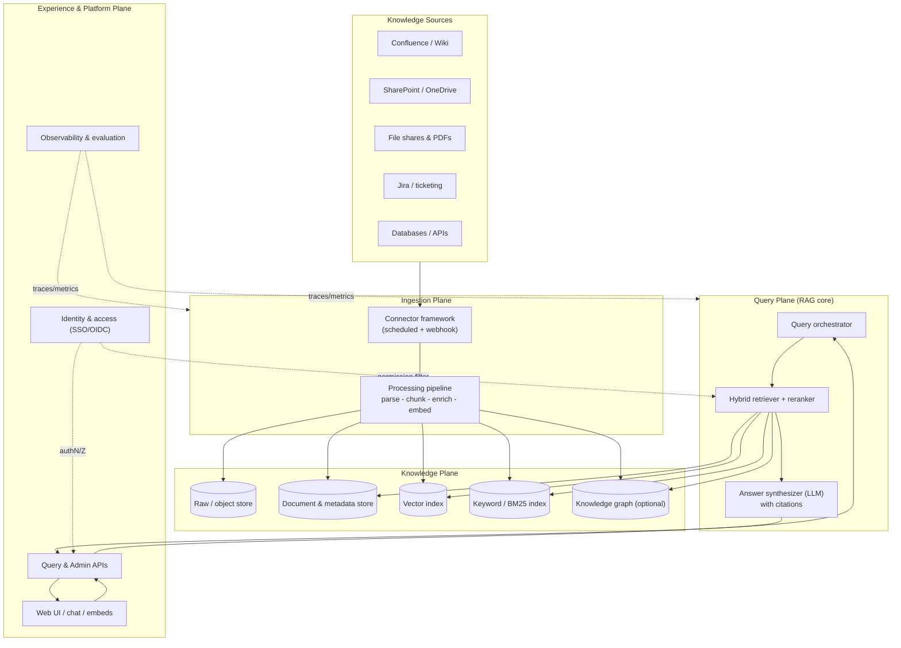
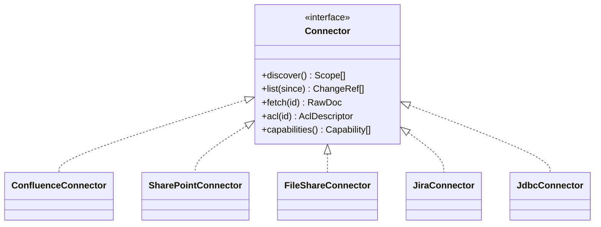
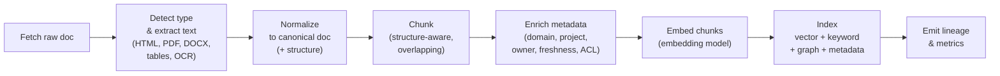
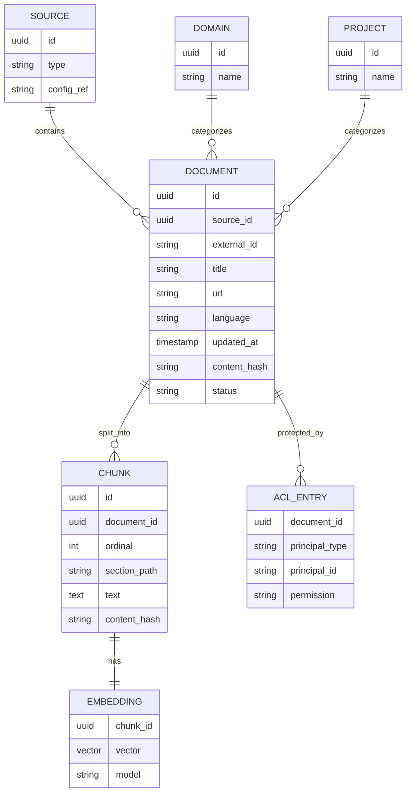
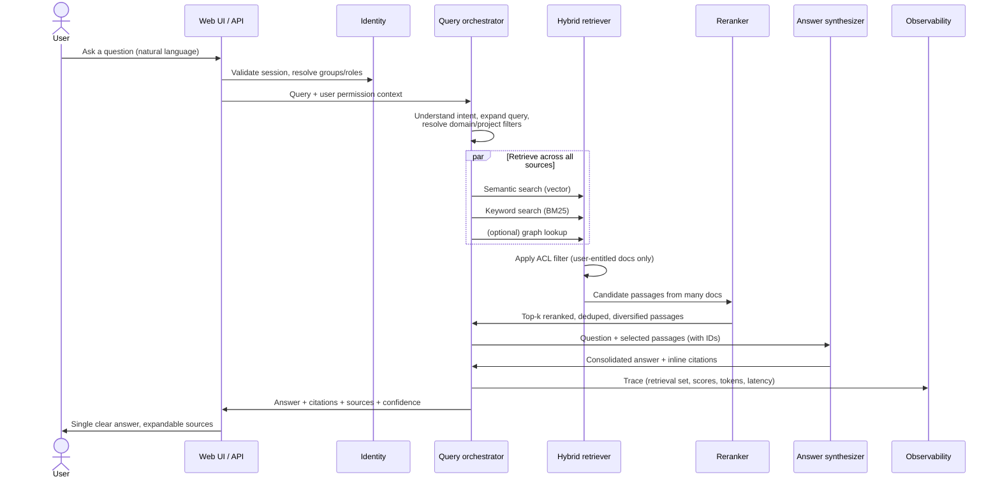
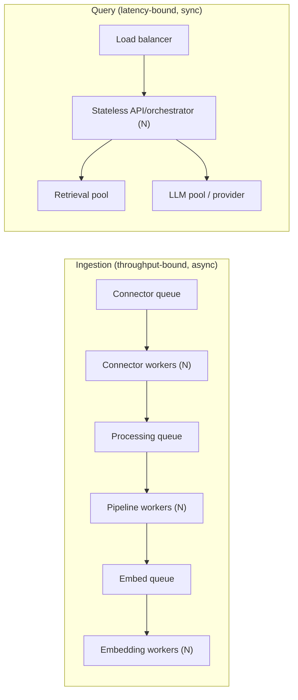
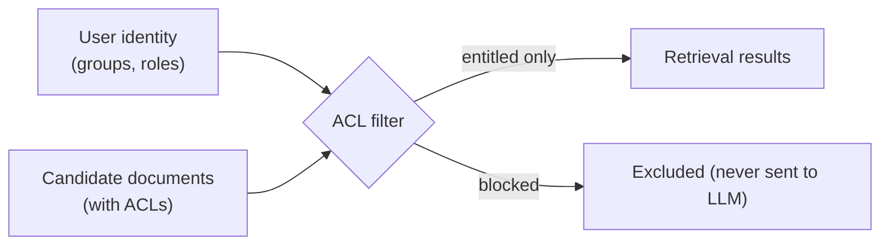
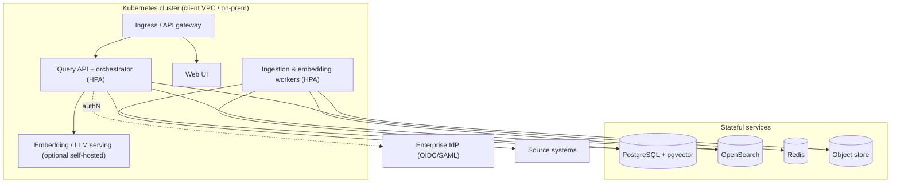

# 2. Technical & Architectural Design

**Platform:** Atlas — Unified Knowledge Platform (UKP)

This document describes the architecture that lets users **ask a question once**
and receive a **consolidated, source-cited answer** synthesized across every
relevant page, while remaining **scalable**, **extensible**, and **secure**.

---

## 2.1 Architecture goals & principles

| Goal | Principle |
|------|-----------|
| **Centralize** knowledge across domains/projects | One normalized knowledge layer behind pluggable connectors. |
| **Ask once, answer once** | RAG pipeline that retrieves across all sources and synthesizes a single grounded answer with citations. |
| **Scalable** | Stateless services, horizontally scalable workers, decoupled async pipelines, a vector store built for billions of chunks. |
| **Extensible** | Connector SDK, schema-driven metadata, swappable embedding/LLM models, plugin points for retrieval and answer formatting. |
| **Trustworthy** | Every answer is grounded in retrieved text and cited; conflicts and staleness are surfaced. |
| **Secure** | Permission-aware retrieval; data isolation; auditable; deployable in VPC/on-prem. |
| **Model-agnostic** | LLM and embedding models are interfaces, not hard dependencies. |
| **Observable** | End-to-end tracing, evaluation harness, and quality dashboards. |

**Non-goals (for the POC):** replacing source systems of record, editing source
content, and fully automated write-back. Atlas is **read-and-synthesize**.

---

## 2.2 High-level architecture

Atlas is composed of four planes:

- **Ingestion plane** — connectors + processing pipeline that turn source
  content into normalized, indexed knowledge.
- **Knowledge plane** — the stores: object/raw store, document/metadata store,
  vector index, keyword index, and (optional) knowledge graph.
- **Query plane** — retrieval, ranking, and answer synthesis (the RAG core).
- **Experience & platform plane** — APIs, UI, identity, security, and
  observability that wrap everything.

---

## 2.3 Ingestion plane

### 2.3.1 Connector framework

Each source system is integrated via a **connector** that implements a small,
well-defined contract. Connectors are the primary **extensibility** point: a new
source is a new connector + configuration, not a core change.

A connector implements:

- `discover()` — enumerate spaces/sites/projects/folders the connector can see.
- `list(since)` — list documents and their change markers since a checkpoint
  (for **incremental sync**).
- `fetch(id)` — return raw content + native metadata for one document.
- `acl(id)` — return the access-control descriptors (groups/users/roles) for a
  document, used for permission-aware retrieval.

Sync modes:

- **Scheduled crawl** — periodic incremental sync using change markers /
  timestamps / cursors.
- **Event-driven** — webhooks (where the source supports them) push near
  real-time updates onto the ingestion queue.
- **Backfill** — one-time full crawl when a source is first connected.

Connectors are **rate-limit aware**, resumable via checkpoints, and run as
independent, horizontally scalable workers.

### 2.3.2 Processing pipeline

Each fetched document flows through an idempotent, queue-driven pipeline. Stages
are independent workers so they scale and fail independently.

Key design choices:

- **Text & structure extraction** for HTML, PDF, Office formats, tables, and
  images (OCR). Structure (headings, sections, tables, lists) is preserved
  because it improves chunking and citation quality.
- **Structure-aware chunking**: split on semantic boundaries (headings,
  paragraphs) with controlled size and overlap; keep a chunk → section →
  document hierarchy so citations can point precisely and answers can expand
  to surrounding context.
- **Deduplication & near-duplicate detection**: content hashing + embedding
  similarity to collapse copies and to *flag* conflicting versions rather than
  silently picking one.
- **Metadata enrichment**: domain/project tagging (rules + classifier),
  ownership, last-updated, source URL, language, and the **ACL descriptor**
  captured at ingest time.
- **Idempotency & change detection**: each chunk has a stable ID derived from
  document + position + content hash; re-processing updates in place and
  deletes orphaned chunks (handles edits and deletions in the source).
- **Versioning & soft-delete**: superseded content is retained for audit and to
  support "as of" answers.

---

## 2.4 Knowledge plane (data stores)

Atlas uses **purpose-fit stores** behind a single logical knowledge layer:

| Store | Purpose | Notes |
|-------|---------|-------|
| **Raw / object store** | Original bytes + extracted text | S3-compatible; cheap, durable, supports reprocessing. |
| **Document & metadata store** | Canonical docs, chunks, metadata, ACLs, lineage | Relational (PostgreSQL) or document DB; source of truth for non-vector data. |
| **Vector index** | Dense embeddings for semantic retrieval | pgvector / OpenSearch / Milvus / Pinecone — pluggable. |
| **Keyword index** | BM25 / lexical retrieval | OpenSearch / Elasticsearch — for exact terms, codes, acronyms. |
| **Knowledge graph (optional)** | Entities & relationships across docs | Enables relationship questions and better disambiguation. |
| **Cache** | Embeddings, hot queries, sessions | Redis. |

> **POC simplification:** PostgreSQL + `pgvector` can serve both metadata and
> vector roles, and OpenSearch can serve both keyword and vector roles. This
> keeps the POC footprint small while preserving a clean path to scale out to
> dedicated stores later.

### 2.4.1 Core data model (simplified)

---

## 2.5 Query plane — the RAG core

This is where "ask once, get a consolidated answer" happens.

### 2.5.1 Query understanding

- **Intent & scope detection**: is this a factual lookup, a "summarize across
  projects" request, a comparison, or a how-to? Detect filters like domain,
  project, time ("current", "as of last quarter").
- **Query expansion / rewriting**: expand acronyms and synonyms, and (for
  conversational use) rewrite follow-ups into standalone queries using session
  context.

### 2.5.2 Hybrid retrieval

Combine **dense (semantic)** and **sparse (keyword/BM25)** retrieval, then fuse
the results (e.g., reciprocal rank fusion). Hybrid retrieval is important
because:

- Semantic search captures meaning and paraphrase.
- Keyword search nails exact terms — product codes, acronyms, IDs, policy
  numbers — that embeddings can miss.

Retrieval is **permission-filtered**: candidate documents are intersected with
the user's entitlements (see §2.7) *before* anything is sent to the LLM, so the
model never sees content the user can't access.

### 2.5.3 Reranking, dedup & diversification

A cross-encoder **reranker** reorders candidates by true relevance to the
question. We then **deduplicate** near-identical passages and **diversify**
across documents/sources so the consolidated answer reflects *all* relevant
pages — not five copies of the same one. A token budget bounds the context.

### 2.5.4 Answer synthesis (consolidation with citations)

The LLM receives the question and the curated passages (each tagged with a
citation ID) under a strict instruction to:

- Answer **only** from the provided passages (grounding).
- **Cite** each claim with the source passage/document.
- **Consolidate** across sources into one coherent answer, and explicitly
  **note conflicts, duplicates, or staleness** when sources disagree or are old.
- Say **"not enough information"** when the retrieved context doesn't support an
  answer — rather than hallucinate.

Output is structured: `answer` (markdown with inline citation markers),
`citations[]` (document title, URL, snippet, freshness, score), and a
`confidence`/coverage signal. Streaming is supported for responsiveness.

> **Anti-hallucination posture:** grounding + citations + "insufficient
> evidence" handling + post-hoc citation verification (check that cited
> passages actually support the sentence) + evaluation harness (§2.9). Trust is
> a first-class feature, not an afterthought.

---

## 2.6 Scalability

- **Decoupled planes**: ingestion (throughput-bound) and query (latency-bound)
  scale independently and never block each other.
- **Async, queue-driven ingestion**: each stage is an idempotent worker;
  back-pressure and retries are handled by the queue. Scale by adding workers.
- **Stateless query services**: orchestrator/API horizontally scale behind a
  load balancer; session state lives in Redis/DB.
- **Vector store scaling**: ANN indexes (HNSW/IVF) with sharding/replication;
  the vector store is an interface so we can move from `pgvector` (POC) to
  Milvus/OpenSearch/managed (scale) without app changes.
- **Caching**: embedding cache (avoid re-embedding unchanged text), query/result
  cache for repeated questions, and reranker caching.
- **Cost & latency controls**: tiered models (cheap model for routing/expansion,
  stronger model for synthesis), token budgeting, and batching of embeddings.
- **Multi-tenancy / isolation**: partition by tenant/domain at the index and
  metadata layer for both performance and security.

Target POC scale: hundreds of thousands to low millions of chunks; the same
design extends to **hundreds of millions+** by swapping in dedicated stores and
adding workers — no architectural change.

---

## 2.7 Security, permissions & governance

Security is central because Atlas reads sensitive enterprise knowledge.

- **Authentication**: SSO via OIDC/SAML; the platform never holds primary
  credentials.
- **Permission-aware retrieval (the critical control)**: each document's ACL is
  captured at ingest (`Connector.acl()`), and at query time results are filtered
  to the **intersection** of the user's resolved groups/roles and the document
  ACLs. The LLM only ever receives passages the user is already entitled to read,
  so answers can't leak restricted content.
- **Permission freshness**: ACLs are refreshed on a schedule and on change
  events; sensitive sources can be checked **late-binding** (re-validated at
  query time) to avoid stale-grant leaks.
- **Data protection**: encryption in transit (TLS) and at rest; secrets in a
  vault/KMS; PII detection and optional redaction in the pipeline.
- **Tenant/domain isolation**: logical (and optionally physical) separation of
  indexes and metadata.
- **Deployment flexibility**: runs in the client's **VPC / private cloud /
  on-prem**; LLM and embedding models can be **self-hosted** so no content
  leaves the boundary where required.
- **Auditability**: every query, the retrieval set, and the answer are logged
  (with access controls on the logs themselves) for compliance and debugging.
- **Governance**: source/freshness policies, content owners, "deprecated"
  flags, and the ability to exclude or quarantine sources.

---

## 2.8 Extensibility

Atlas is designed so that **growth is configuration, not re-architecture**.

| Extension point | How it extends | Example |
|-----------------|----------------|---------|
| **Connectors** | Implement the connector contract (§2.3.1) | Add ServiceNow, GitHub, a custom REST API. |
| **Domains/projects** | Schema-driven metadata + tagging rules/classifier | Onboard a new business domain with its taxonomy. |
| **Embedding model** | Embedding interface | Swap to a domain-tuned or newer model; re-embed via pipeline. |
| **LLM** | Synthesizer interface | Switch providers, run self-hosted, or route by query type. |
| **Retrieval strategy** | Pluggable retrievers/rerankers | Add graph retrieval, parent-document retrieval, multi-hop. |
| **Answer formats** | Output templates | "Brief", "detailed with citations", "comparison table", "checklist". |
| **Surfaces** | API-first | Web app, chat, IDE/Slack/Teams plugins, embedded widgets. |

Everything the query plane consumes is an **interface**: vector store, keyword
store, embedding model, reranker, and LLM are all swappable. This is what keeps
the platform **model-agnostic** and **vendor-flexible**.

---

## 2.9 Observability, evaluation & quality

You cannot ship trustworthy answers without measuring them.

- **Tracing**: OpenTelemetry traces across ingestion and query (which chunks
  were retrieved, scores, tokens, latency per stage).
- **Metrics & dashboards**: ingestion throughput/freshness, query latency
  (p50/p95), retrieval hit rates, cache rates, model cost/usage.
- **RAG evaluation harness** (run continuously and pre-release) on a curated
  question set with known good answers/sources:
  - **Retrieval quality**: recall@k, MRR, nDCG.
  - **Answer quality**: groundedness/faithfulness, answer relevance,
    **citation correctness** (does the cited passage support the claim?).
  - **Safety**: hallucination rate, refusal correctness ("not enough info").
- **Human feedback loop**: thumbs up/down + comments on answers feed evaluation
  and prioritize source/quality fixes.
- **Regression gating**: model/prompt/retrieval changes must not regress the
  evaluation suite before promotion.

---

## 2.10 Reference technology stack

The stack is a **recommendation**; each layer is swappable and final choices
adapt to the client's existing platform and constraints.

| Layer | POC recommendation | Scale / alternatives |
|-------|--------------------|----------------------|
| Connectors & pipeline | Python workers (FastAPI control plane) | Same, scaled horizontally |
| Orchestration / RAG | LangChain / LlamaIndex or a thin custom orchestrator | Custom orchestrator for full control |
| Queue / async | Redis Streams / RabbitMQ | Kafka / managed queues (SQS) |
| Metadata store | PostgreSQL | PostgreSQL (HA) / managed |
| Vector index | PostgreSQL + `pgvector` | Milvus / OpenSearch / Pinecone |
| Keyword index | OpenSearch / Elasticsearch | Same, clustered |
| Object store | S3-compatible (MinIO/S3) | Cloud object storage |
| Cache | Redis | Redis cluster |
| Embeddings | Managed or self-hosted embedding model | Domain-tuned / self-hosted |
| LLM | Managed API **or** self-hosted (VPC/on-prem) | Self-hosted for data residency |
| Identity | OIDC/SAML via existing IdP | Same |
| Frontend | React/Next.js + streaming chat | Same |
| Deployment | Docker + Kubernetes (Helm) | K8s + autoscaling, multi-AZ |
| Observability | OpenTelemetry + Prometheus/Grafana | + tracing/eval tooling |

---

## 2.11 Deployment view

All components run inside the client's security boundary; the only optional
egress is to a managed LLM/embedding API, which can be removed entirely by
self-hosting the models.

---

## 2.12 Key non-functional targets (POC)

| Attribute | Target (POC) |
|-----------|--------------|
| Answer latency | First token in a few seconds; full answer typically < ~10s |
| Retrieval recall@10 | High on curated benchmark (tuned during POC) |
| Citation correctness | Majority of claims correctly supported; measured & improved |
| Freshness | Source changes reflected within minutes (events) to hours (crawl) |
| Availability | Single-region HA for POC; multi-AZ path for production |
| Security | 100% permission-aware retrieval; no cross-entitlement leakage |

Concrete numeric thresholds are set with the client during POC kickoff and
tracked via the evaluation harness (§2.9).

See [`03-poc-plan.md`](./03-poc-plan.md) for how we validate all of this.
