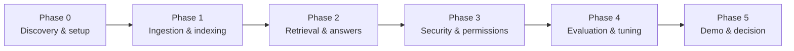

# 3. POC Plan — Scope, Success Criteria, Evaluation & Risks

**Platform:** Atlas — Unified Knowledge Platform (UKP)

This document defines what the POC will and will not do, how we will prove it
works, what we need from the client, and how we de-risk the path to production.

---

## 3.1 POC objectives

Prove, end to end, on a representative slice of real content, that Atlas can:

1. **Unify** heterogeneous knowledge sources behind one knowledge layer.
2. Answer cross-document questions with a **single, consolidated, cited answer**.
3. Enforce **permission-aware** retrieval (no cross-entitlement leakage).
4. Meet **measurable quality and latency** targets on a curated benchmark.
5. Demonstrate a credible path to **scale and extend** to all sources/domains.

## 3.2 Scope

### In scope

- **2–3 connectors** to representative sources (e.g., Confluence/wiki +
  SharePoint/file share + one structured source such as Jira).
- **1–2 priority domains/projects** chosen with the client for high value and
  manageable size.
- Full ingestion pipeline: parse → chunk → enrich → embed → index (incremental).
- Hybrid retrieval + reranking + grounded answer synthesis **with citations**.
- Permission-aware retrieval honoring source ACLs for a defined set of test
  users/groups.
- A simple but polished **web chat/search UI** with expandable source citations.
- **Evaluation harness** + a curated benchmark question set with results report.
- **Reference architecture** and **production rollout plan**.

### Out of scope (for the POC)

- Connecting *every* source and domain (proven extensible, rolled out post-POC).
- Editing or writing back to source systems.
- Fully autonomous agents/workflows (a clear future extension).
- Production-grade HA/DR hardening (designed for, not fully built in POC).
- Org-wide change management and training (planned in rollout phase).

## 3.3 Phased plan

| Phase | Focus | Key outputs |
|-------|-------|-------------|
| **0 — Discovery & setup** | Confirm sources, domains, test users, success metrics; provision environment in client VPC; security review. | Signed-off scope, environment, access. |
| **1 — Ingestion & indexing** | Build/configure connectors; run backfill + incremental; populate stores. | Indexed corpus, ingestion metrics, freshness. |
| **2 — Retrieval & answers** | Hybrid retrieval, reranking, grounded synthesis with citations; UI. | Working Q&A demo over the corpus. |
| **3 — Security & permissions** | ACL capture + permission-aware retrieval; isolation; audit logging. | Permission test suite passing. |
| **4 — Evaluation & tuning** | Build benchmark set; measure; tune chunking/retrieval/prompts. | Quality report vs. targets. |
| **5 — Demo & decision** | Stakeholder demo; results review; production plan & costing. | Go/no-go package. |

> Phases are sequenced by dependency, not by calendar. Each phase has explicit
> entry/exit criteria so progress is measured by completed capability, not time.

## 3.4 Success criteria (acceptance)

The POC is successful if, on the curated benchmark and live demo:

| # | Criterion | How measured |
|---|-----------|--------------|
| 1 | Cross-document consolidated answers | Demo + benchmark: answers synthesize from multiple sources, not single-doc lookups. |
| 2 | Grounded & cited | Every substantive claim carries a citation; citation correctness measured and above the agreed threshold. |
| 3 | Retrieval quality | recall@k / nDCG on benchmark above agreed threshold. |
| 4 | Permission safety | 100% of permission tests pass; no test user receives content they cannot access. |
| 5 | Latency | First token within a few seconds; full answers within the agreed bound. |
| 6 | Freshness | Source edits/deletes reflected within the agreed window. |
| 7 | Extensibility shown | Adding a new connector/domain demonstrated as configuration + small connector. |
| 8 | Stakeholder validation | SMEs rate answers as useful/accurate on a sample with positive majority. |

Exact numeric thresholds are agreed in Phase 0.

## 3.5 Evaluation methodology

- **Benchmark set**: 50–150 real questions per domain, authored with SMEs, each
  with expected answer + expected source documents.
- **Automated metrics**: retrieval (recall@k, MRR, nDCG); answer
  (groundedness/faithfulness, relevance, citation correctness); safety
  (hallucination rate, correct refusals).
- **Human review**: SMEs score a sample for accuracy/usefulness; thumbs
  up/down in the UI feeds the loop.
- **Regression gating**: any change to chunking, retrieval, prompts, or models
  is re-scored before adoption.
- **Reporting**: a single quality dashboard + a written results report for the
  go/no-go decision.

## 3.6 What we need from the client

| Need | Why |
|------|-----|
| Read access to 2–3 representative sources (service accounts) | Ingestion. |
| Choice of 1–2 priority domains/projects | Focus + value. |
| 3–5 test users/groups with varied permissions | Permission validation. |
| SME time for the benchmark + answer review | Quality measurement. |
| Security/IT contact + environment in client VPC | Secure deployment & review. |
| A product owner / sponsor | Decisions & prioritization. |

## 3.7 Team model (lean POC)

| Role | Responsibility |
|------|----------------|
| Product owner (client) | Priorities, scope decisions, stakeholder access. |
| Solution architect | Architecture, integration, security alignment. |
| ML/RAG engineer | Retrieval, embeddings, synthesis, evaluation. |
| Backend engineer | Connectors, pipeline, APIs, stores. |
| Frontend engineer (part-time) | Chat/search UI. |
| SME(s) (client) | Domain validation, benchmark authoring. |
| Security/IT (client) | Access, deployment, compliance review. |

## 3.8 Cost considerations

POC cost is modest and dominated by:

- **Infrastructure**: a small Kubernetes footprint + stateful stores (can run in
  the client's existing cloud/VPC).
- **Model usage**: embeddings (one-time-ish for the corpus + incremental) and
  LLM synthesis per query. Controlled via tiered models, caching, batching, and
  token budgeting. Self-hosting models trades API cost for compute and removes
  egress concerns.
- **People**: the lean team above.

We will provide a per-query and monthly cost estimate after Phase 1, once corpus
size and query volume assumptions are validated. The architecture's cost levers
(model tiering, caching, batching) let us tune the cost/quality trade-off
explicitly.

## 3.9 Risks & mitigations

| Risk | Impact | Mitigation |
|------|--------|------------|
| **Source access / API limits** delay ingestion | Schedule | Start access requests in Phase 0; rate-limit-aware, resumable connectors. |
| **Answer quality / hallucination** below bar | Trust | Grounding + citations + refusal handling + citation verification + evaluation gating; tune chunking/retrieval. |
| **Permission leakage** | Severe (security) | Permission-aware retrieval as a core control; dedicated permission test suite; late-binding checks for sensitive sources; audit logs. |
| **Messy / inconsistent content** | Quality | Dedup + conflict flagging + freshness signals; surface (not hide) disagreements. |
| **Data residency / privacy** | Compliance | VPC/on-prem deployment; self-hostable models; PII detection/redaction; encryption + KMS. |
| **Scope creep** (connect everything now) | Schedule | Strict POC scope; extensibility proven, full rollout phased post-POC. |
| **Cost surprises at scale** | Budget | Tiered models, caching, batching; cost estimate after Phase 1; cost dashboard. |
| **Vendor/model lock-in** | Strategy | Model-agnostic interfaces; swappable stores, embeddings, and LLM. |
| **User adoption** | Value realization | Polished UX, citations build trust, feedback loop; change management in rollout. |

## 3.10 From POC to production (path to scale)

Once the POC clears go/no-go:

1. **Broaden connectors & domains** — onboard remaining sources/domains
   (configuration + connectors), with per-source freshness and ACL policies.
2. **Harden for scale** — move to dedicated vector/keyword stores, add workers,
   enable autoscaling, multi-AZ, HA/DR, and backups.
3. **Operationalize quality** — continuous evaluation, regression gating,
   feedback-driven improvement, content-owner workflows.
4. **Expand surfaces** — chat, Slack/Teams, IDE, and embedded widgets via the
   API-first design.
5. **Extend capabilities** — comparison/table answers, multi-hop reasoning,
   scheduled briefings, and (carefully governed) agentic workflows.

The result is a durable, organization-wide knowledge asset: **ask once, get a
clear, consolidated, trustworthy answer — across every domain and project.**

## 3.11 Summary

The POC is a **time-boxed, low-risk, high-signal** proof that delivers a working
demo, a measured quality report, and a production-ready reference architecture.
It proves the core promise on real content and gives the client an evidence-based
go/no-go decision with a clear, phased path to full rollout.
