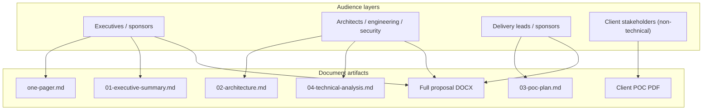
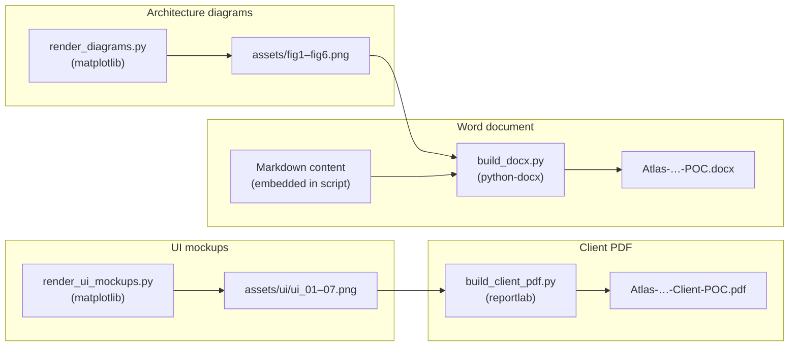

# 4. Technical Analysis — Repository & Platform

**Platform:** Atlas — Unified Knowledge Platform (UKP)  
**Document type:** Technical analysis (repository inventory + platform assessment)  
**Based on:** Project directory as of July 2026  
**Status:** Draft

---

## 4.1 Executive summary

This repository is a **documentation and artifact-generation workspace** for the Atlas Unified Knowledge Platform proof of concept. It does **not** contain application runtime code (no API services, connectors, RAG pipeline, or frontend implementation). Instead, it houses:

- A structured **proposal document set** (executive summary, architecture, POC plan).
- A **Python build toolchain** that generates client-facing deliverables (PDF, Word, diagrams, UI mockups).
- **Pre-built artifacts** ready for client distribution.

The technical analysis below covers (a) what exists in the repository today, (b) how the documentation pipeline works, (c) the proposed platform design as documented, and (d) gaps, risks, and recommended next steps toward implementation.

| Dimension | Current state |
|-----------|---------------|
| **Repository type** | Documentation + build scripts only |
| **Application code** | None |
| **Primary language** | Python (build tooling); Markdown (source content) |
| **Deliverables** | PDF, DOCX, PNG diagrams, UI mockups |
| **License** | MIT (Copyright 2026 CJ-Covance) |
| **Proposed platform** | Enterprise RAG knowledge platform (design only) |

---

## 4.2 Repository structure

```
/workspace/
├── LICENSE                          # MIT license
└── docs/
    └── poc/
        ├── README.md                # Index and rebuild instructions
        ├── 01-executive-summary.md  # Business case and value proposition
        ├── 02-architecture.md       # Full technical & architectural design
        ├── 03-poc-plan.md           # Scope, phases, success criteria, risks
        ├── one-pager.md             # Circulation brief
        ├── 04-technical-analysis.md # This document
        ├── Atlas-Unified-Knowledge-Platform-Client-POC.pdf   # Client PDF (710 KB)
        ├── Atlas-Unified-Knowledge-Platform-POC.docx         # Full proposal DOCX (1.3 MB)
        ├── build/                   # Python artifact generators (~2,079 LOC)
        │   ├── build_client_pdf.py
        │   ├── build_docx.py
        │   ├── render_diagrams.py
        │   └── render_ui_mockups.py
        └── assets/                  # Generated PNG assets
            ├── fig1_architecture.png … fig6_deployment.png
            └── ui/ui_01_home.png … ui_07_journey.png
```

### 4.2.1 Inventory

| Category | Count | Notes |
|----------|-------|-------|
| Total files | ~56 | Entire workspace |
| Markdown source docs | 6 | Including this analysis |
| Python build scripts | 4 | ~2,079 lines combined |
| Architecture diagrams | 6 | `fig1`–`fig6` (300 DPI PNG) |
| UI mockup screens | 7 | `ui_01`–`ui_07` (200 DPI PNG) |
| Binary deliverables | 2 | PDF + DOCX |
| Application source | 0 | No `src/`, `app/`, or service code |

### 4.2.2 Git context

- Repository is version-controlled (git worktree).
- Active branch at analysis time: `cursor/client-poc-pdf-827d`.
- Content is organized for client POC presentation and stakeholder review.

---

## 4.3 Documentation architecture

The proposal follows a deliberate **layered documentation model** aligned to audience and depth:



| Document | Primary audience | Technical depth | Key focus |
|----------|------------------|-----------------|-----------|
| `one-pager.md` | Broad circulation | Low | Problem, solution, ask |
| `01-executive-summary.md` | Executives, sponsors | Low–medium | Business case, outcomes, feasibility |
| `02-architecture.md` | Architects, security | High | Four-plane design, RAG, security, stack |
| `03-poc-plan.md` | Delivery, sponsors | Medium | Scope, phases, metrics, risks, team |
| `04-technical-analysis.md` | Engineering leads | High | Repo inventory, gaps, implementation path |
| Client PDF | End users, client execs | Low (UX journey) | User journey with UI illustrations |
| DOCX | Formal client distribution | Medium–high | Consolidated printable proposal |

### 4.3.1 Content consistency

Across documents, the core narrative is consistent:

1. **Problem:** Enterprise knowledge is fragmented across tools; answering cross-team questions requires manual synthesis.
2. **Solution:** Atlas unifies sources via connectors, indexes content for hybrid retrieval, and returns grounded, cited answers via RAG.
3. **Differentiators:** Permission-aware retrieval, model-agnostic design, horizontal scalability, continuous evaluation.
4. **POC scope:** 2–3 connectors, 1–2 domains, measurable quality on a curated benchmark.

No contradictions were found between the executive, architecture, and plan documents regarding scope or technical approach.

---

## 4.4 Build toolchain analysis

The repository includes a **reproducible, dependency-light build pipeline** for client deliverables. All generators are pure Python with no system-level dependencies (no Graphviz, no Mermaid CLI, no Node.js).

### 4.4.1 Pipeline overview



### 4.4.2 Script responsibilities

| Script | Lines | Dependencies | Output |
|--------|-------|--------------|--------|
| `render_diagrams.py` | ~309 | `matplotlib` | 6 architecture/flow PNGs at 300 DPI |
| `render_ui_mockups.py` | ~397 | `matplotlib` | 7 browser-style UI mockup PNGs at 200 DPI |
| `build_docx.py` | ~933 | `python-docx`, `matplotlib` (for figures) | Formatted Word document with TOC, tables, figures |
| `build_client_pdf.py` | ~440 | `reportlab`, `pillow` | User-journey PDF with step-by-step instructions |

### 4.4.3 Design characteristics

- **Self-contained rendering:** Diagrams and UI mockups are drawn programmatically with matplotlib rather than external diagram tools, ensuring reproducibility in CI or restricted environments.
- **Branded styling:** Consistent palette across artifacts — navy (`#1F3A5F`), blue (`#2E5E8C`), gold accent (`#B78A2E` / `#C8A24B`), light backgrounds (`#EAF1F8`).
- **Separation of concerns:** Asset generation is decoupled from document assembly; PDF and DOCX builds fail fast if required PNGs are missing.
- **Content duplication:** `build_docx.py` embeds proposal content directly in Python rather than reading from Markdown. Updates to `01`–`03` markdown files are **not automatically propagated** to DOCX/PDF — maintainers must update build scripts or introduce a templating layer.

### 4.4.4 Rebuild commands

```bash
# Word document pipeline
pip install python-docx matplotlib
python docs/poc/build/render_diagrams.py
python docs/poc/build/build_docx.py

# Client PDF pipeline
pip install matplotlib reportlab pillow
python docs/poc/build/render_ui_mockups.py
python docs/poc/build/build_client_pdf.py
```

### 4.4.5 Toolchain gaps

| Gap | Impact | Recommendation |
|-----|--------|----------------|
| No `requirements.txt` or `pyproject.toml` | Manual dependency install | Add pinned dependency file |
| No CI/CD configuration | Artifacts may drift from source | Add GitHub Actions or similar to rebuild on change |
| Markdown ↔ DOCX not linked | Content divergence risk | Introduce Pandoc/mkdocs pipeline or single source of truth |
| No automated tests for build scripts | Regressions undetected | Add smoke tests that verify artifact generation |
| No `Makefile` or task runner | Discoverability | Add `make docx` / `make pdf` targets |

---

## 4.5 Proposed platform — technical synthesis

The following summarizes the **documented** Atlas platform design. None of this is implemented in this repository; it represents the target architecture for a future POC build.

### 4.5.1 Architectural planes

Atlas is designed as four decoupled planes:

| Plane | Responsibility | Scaling model |
|-------|----------------|---------------|
| **Ingestion** | Connectors + parse/chunk/enrich/embed pipeline | Async, queue-driven, horizontally scaled workers |
| **Knowledge** | Object store, metadata DB, vector index, keyword index, optional graph | Purpose-fit stores behind unified logical layer |
| **Query** | Orchestration, hybrid retrieval, reranking, LLM synthesis | Stateless sync services behind load balancer |
| **Experience & platform** | APIs, UI, identity, observability | API-first; multiple surfaces (web, chat, embeds) |

### 4.5.2 Core data flow

1. **Ingest:** Connectors (`discover`, `list`, `fetch`, `acl`) pull content incrementally from source systems.
2. **Process:** Documents are parsed, structure-aware chunked, enriched with metadata/ACLs, embedded, and indexed.
3. **Query:** User question → intent detection → hybrid retrieval (vector + BM25) → ACL filter → rerank → LLM synthesis with citations.
4. **Respond:** Structured output — answer markdown, citation array, confidence/coverage signal; streaming supported.

### 4.5.3 Connector contract

The primary extensibility point is a well-defined connector interface:

```
discover()  → enumerate scopes
list(since) → incremental change refs
fetch(id)   → raw content + metadata
acl(id)     → access-control descriptors
```

Planned POC connectors: Confluence/wiki, SharePoint/file share, and one structured source (e.g., Jira).

### 4.5.4 Security model

Security is **retrieval-time**, not post-hoc:

- ACLs captured at ingest via `Connector.acl()`.
- At query time, candidates are filtered to the intersection of user entitlements and document ACLs **before** any content reaches the LLM.
- Supports late-binding ACL re-validation for sensitive sources.
- Deployable in client VPC/on-prem with optional self-hosted models.

### 4.5.5 Reference technology stack (proposed)

| Layer | POC recommendation | Scale path |
|-------|-------------------|------------|
| Connectors / pipeline | Python workers (FastAPI control plane) | Horizontal workers |
| Orchestration | LangChain / LlamaIndex or thin custom | Custom orchestrator |
| Queue | Redis Streams / RabbitMQ | Kafka / SQS |
| Metadata | PostgreSQL | HA PostgreSQL |
| Vector index | PostgreSQL + pgvector | Milvus / OpenSearch / Pinecone |
| Keyword index | OpenSearch / Elasticsearch | Clustered |
| Object store | S3-compatible (MinIO) | Cloud object storage |
| Cache | Redis | Redis cluster |
| Frontend | React/Next.js + streaming chat | Same |
| Deployment | Docker + Kubernetes (Helm) | Multi-AZ autoscaling |
| Observability | OpenTelemetry + Prometheus/Grafana | + eval tooling |

### 4.5.6 Non-functional targets (POC)

| Attribute | Target |
|-----------|--------|
| Answer latency | First token in seconds; full answer typically < ~10s |
| Retrieval recall@10 | High on curated benchmark (tuned during POC) |
| Citation correctness | Majority of claims correctly supported |
| Permission safety | 100% — no cross-entitlement leakage |
| Freshness | Minutes (events) to hours (crawl) |

---

## 4.6 POC scope and validation framework

### 4.6.1 In scope

- 2–3 connectors, 1–2 priority domains.
- Full ingestion pipeline with incremental sync.
- Hybrid retrieval + reranking + grounded synthesis with citations.
- Permission-aware retrieval for defined test users/groups.
- Web chat/search UI with expandable citations.
- Evaluation harness + curated benchmark (50–150 questions per domain).
- Reference architecture and production rollout plan.

### 4.6.2 Out of scope

- All sources/domains (extensibility demonstrated, rollout post-POC).
- Write-back to source systems.
- Production HA/DR.
- Autonomous agents/workflows.

### 4.6.3 Phased delivery model

| Phase | Focus |
|-------|-------|
| 0 | Discovery, environment, security review |
| 1 | Connectors, backfill, indexing |
| 2 | Retrieval, synthesis, UI |
| 3 | ACL enforcement, audit logging |
| 4 | Benchmark, tuning, quality report |
| 5 | Demo, go/no-go, production plan |

### 4.6.4 Evaluation metrics

- **Retrieval:** recall@k, MRR, nDCG.
- **Answer quality:** groundedness, relevance, citation correctness.
- **Safety:** hallucination rate, correct refusals.
- **Human review:** SME scoring, UI feedback loop.
- **Regression gating:** changes must not regress the evaluation suite.

---

## 4.7 Gap analysis — repository vs. proposed platform

| Component | Documented | In repository | Gap severity |
|-----------|------------|---------------|--------------|
| Connector framework | Yes | No | **Critical** — core POC deliverable |
| Ingestion pipeline | Yes | No | **Critical** |
| Vector / keyword stores | Yes | No | **Critical** |
| RAG query orchestrator | Yes | No | **Critical** |
| Permission-aware retrieval | Yes | No | **Critical** |
| Web UI | Yes (mockups only) | No implementation | **High** |
| Evaluation harness | Yes | No | **High** |
| Kubernetes deployment | Yes | No | **Medium** (POC can start simpler) |
| Observability stack | Yes | No | **Medium** |
| Proposal documentation | Yes | **Complete** | None |
| Client deliverables (PDF/DOCX) | Yes | **Complete** | None |
| Build toolchain | N/A | **Complete** | None |

**Conclusion:** The repository fully supports the **proposal and client presentation** phase. Implementation of the Atlas platform itself has not begun in this codebase.

---

## 4.8 Risk assessment (technical)

| Risk | Likelihood | Impact | Mitigation (from docs + analysis) |
|------|------------|--------|-----------------------------------|
| Content drift between Markdown and build scripts | Medium | Medium | Single-source pipeline; CI rebuild |
| No implementation baseline | High | High | Scaffold monorepo per architecture planes |
| Permission leakage in future build | Medium | Severe | ACL filter before LLM; dedicated test suite |
| Answer quality below threshold | Medium | High | Evaluation harness from Phase 2 onward |
| Build dependency unpinned | Medium | Low | Add `requirements.txt` with versions |
| Scope creep beyond 2–3 connectors | Medium | Medium | Strict POC boundaries in `03-poc-plan.md` |

---

## 4.9 Recommendations

### 4.9.1 Short term (repository hygiene)

1. Add `docs/poc/requirements.txt` with pinned versions (`matplotlib`, `python-docx`, `reportlab`, `pillow`).
2. Add a `Makefile` or `justfile` with `make diagrams`, `make docx`, `make pdf`, `make all`.
3. Add CI workflow to rebuild artifacts and verify no missing assets.
4. Cross-link this analysis from `README.md`.

### 4.9.2 Medium term (POC implementation)

When moving from proposal to build, recommended repository structure:

```
atlas/
├── connectors/          # Connector SDK + Confluence, SharePoint, Jira
├── pipeline/            # Parse, chunk, enrich, embed workers
├── knowledge/           # Store abstractions (metadata, vector, keyword)
├── query/               # Orchestrator, retriever, reranker, synthesizer
├── api/                 # FastAPI query + admin APIs
├── web/                 # React/Next.js chat UI
├── eval/                # Benchmark set + metrics harness
├── infra/               # Docker Compose (POC) → Helm (production)
└── docs/poc/            # Existing proposal (retained)
```

Suggested POC infrastructure simplification (per architecture doc): PostgreSQL + pgvector for metadata and vectors; Redis for queue/cache; MinIO for object storage; optional OpenSearch for keyword search.

### 4.9.3 Implementation priorities

1. **Connector SDK + one connector** (prove ingest path).
2. **Pipeline workers** (parse → chunk → embed → index).
3. **Hybrid retriever + basic synthesis** (prove RAG loop).
4. **ACL capture and filter** (before any external demo).
5. **Evaluation harness** (parallel with retrieval tuning).
6. **UI** (can start API-only; UI mockups in `assets/ui/` serve as spec).

---

## 4.10 Conclusion

This repository is a **mature, client-ready POC proposal package** for Atlas — Unified Knowledge Platform. The documentation is thorough, internally consistent, and supported by a reproducible Python build pipeline that produces professional PDF, Word, and visual assets.

What it is **not** yet: an implementation of the proposed platform. The technical design in `02-architecture.md` and the delivery plan in `03-poc-plan.md` provide a credible blueprint; the next phase is scaffolding the application codebase against that design and executing the six-phase POC plan.

| Strength | Limitation |
|----------|------------|
| Clear four-plane architecture | No runtime code |
| Permission-first security model | Not yet validated in code |
| Model-agnostic, extensible design | Connectors unbuilt |
| Measurable POC success criteria | Evaluation harness unbuilt |
| Professional client deliverables | Markdown ↔ DOCX not automated |
| Reproducible diagram/UI generation | No CI or dependency pinning |

---

## 4.11 References

| Resource | Path |
|----------|------|
| Document index | [`README.md`](./README.md) |
| Executive summary | [`01-executive-summary.md`](./01-executive-summary.md) |
| Architecture design | [`02-architecture.md`](./02-architecture.md) |
| POC plan | [`03-poc-plan.md`](./03-poc-plan.md) |
| One-page brief | [`one-pager.md`](./one-pager.md) |
| Client PDF | [`Atlas-Unified-Knowledge-Platform-Client-POC.pdf`](./Atlas-Unified-Knowledge-Platform-Client-POC.pdf) |
| Full proposal DOCX | [`Atlas-Unified-Knowledge-Platform-POC.docx`](./Atlas-Unified-Knowledge-Platform-POC.docx) |
