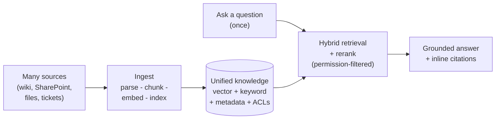

# Atlas — Unified Knowledge Platform · One-Page Brief

**Ask once. Get one clear, cited answer — from every relevant page.**

---

### The problem
Knowledge is scattered across wikis, SharePoint, file shares, and ticketing
systems. Answering one cross-team question means finding, reading, and
reconciling many documents by hand — costing experts hours and producing
inconsistent, hard-to-trust answers.

### The solution — Atlas
A scalable, extensible enterprise platform that **centralizes knowledge across
domains and projects** and answers natural-language questions with a **single,
consolidated, source-cited summary** — not a list of links — while honoring each
user's existing access permissions.

### How it works (4 steps)
1. **Unify** — connectors continuously ingest content from many systems into one
   normalized, searchable knowledge layer.
2. **Understand** — content is parsed, chunked, embedded, and indexed for
   semantic + keyword retrieval, enriched with domain/project/owner/freshness/ACL.
3. **Retrieve** — a hybrid retriever + reranker finds the most relevant passages
   across *all* sources, filtered to what the user may access.
4. **Answer** — an LLM consolidates those passages into one grounded answer with
   inline citations, flagging conflicts and staleness, and refusing when evidence
   is insufficient.

### Why it's the right architecture
- **Scalable** — decoupled async ingestion + stateless query services; vector
  store scales to hundreds of millions of chunks by swapping stores and adding
  workers, with no architectural change.
- **Extensible** — new sources = a small connector; embeddings, LLM, stores, and
  retrieval strategies are all swappable interfaces (no vendor lock-in).
- **Secure** — permission-aware retrieval (the LLM only sees what the user can
  access); deployable in the client's VPC/on-prem; self-hostable models;
  encrypted and auditable.
- **Trustworthy** — every answer is grounded and cited, with a continuous
  evaluation harness measuring relevance, groundedness, and citation correctness.

### The POC proves
Unified ingestion · cross-document cited answers · permission safety · measured
quality & latency · a clear path to scale — on **2–3 sources** and **1–2 domains**.

### The ask
A time-boxed POC with access to representative sources and a small client working
group. Deliverables: a working demo, a measured quality report, and a production
reference architecture with a phased rollout plan.

> Full details: [`01-executive-summary.md`](./01-executive-summary.md) ·
> [`02-architecture.md`](./02-architecture.md) ·
> [`03-poc-plan.md`](./03-poc-plan.md)
